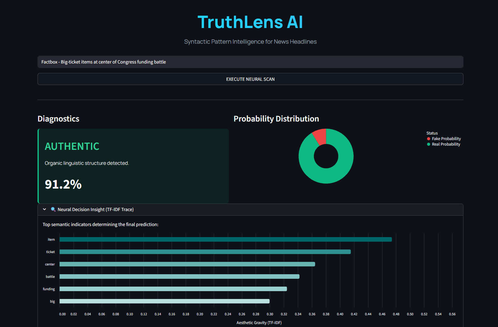
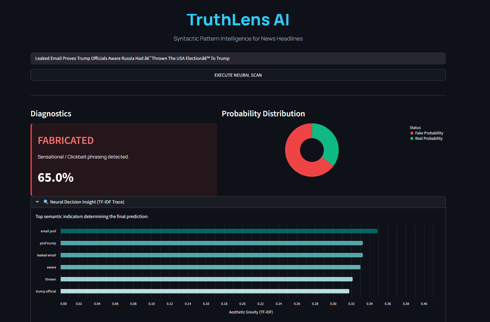

<div align="center">
  
# 📰 Fake News Detection

**A High-Performance Natural Language Processing Engine for Authenticity Verification**


</div>

---

## 📖 Overview
The **Fake News Detection** system is an end-to-end Machine Learning pipeline designed to evaluate the authenticity of news headlines. By strictly analyzing semantic constructs, syntax patterns, and underlying linguistic features, the pipeline classifies text as either seamlessly factual (**Authentic**) or highly sensationalized and click-driven (**Fabricated**).

It utilizes advanced `scikit-learn` algorithms integrated with a hyper-modern, interactive **Streamlit dashboard** capable of real-time predictions and analytical data visualizations using **Altair**.

## 📸 UI Output
Here is a glimpse of the state-of-the-art TruthLens AI Dashboard predicting both fabricated sensationalism and authentic structural data.

<div align="center">
  
  &nbsp;
  
</div>

---

## ✨ Core Features

* **Headlines-First Inference**: Specifically tuned to perform deep inference on short-form News Titles, stripping away the noise of article bodies for lightning-fast verification.
* **Dual-Model Baseline Architecture**: The automated training runner evaluates both `LogisticRegression` and `MultinomialNB`, transparently selecting the highest-performing matrix before saving the pipeline artifacts.
* **Model Explainability Engine**: Rather than producing a "black-box" prediction, the system interactively charts out exact **TF-IDF Neural Resonance Weights** dynamically—showing you the exact words that activated the model’s prediction.
* **Streamlit Pro-UI**: Includes custom CSS, native dynamic graphs (Donut charts & horizontal token graphs), and a completely modern dark-mode centered aesthetic.

---

## 🛠️ Stack & Architecture

- **Core Logic & Manipulation**: `pandas`, `numpy`, `regex` (`re`)
- **NLP Text Processing**: `NLTK` (Tokenization, WordNet Lemmatization, Stop-word elimination) 
- **Machine Learning**: `scikit-learn` (Feature Extraction via TF-IDF, Logistic Regression)
- **Web UI & Visualization**: `streamlit`, `altair`

---

## 🚀 Quickstart & Installation

**1. Clone the environment**
Ensure your local terminal is securely routed to the cloned repository.
```bash
git clone https://github.com/yourusername/Fake-News-Detection.git
cd Fake-News-Detection
```

**2. Establish Dependencies**
Install the strict requirements needed for Neural Vectorization and Web deployment:
```bash
pip install -r requirements.txt
```

**3. Dataset Placement**
Download the training data (for example, the ISOT Fake News dataset involving both `Fake.csv` and `True.csv`), and place these directly inside the `/data/` folder.

**4. Train the NLP Engine**
Run the core Machine Learning script. This file automatically evaluates the textual boundaries and outputs highly-optimized `.pkl` serialized artifacts into `/models/`.
```bash
python train_models.py
```

**5. Launch the Web Interface**
Finally, spin up the local server to begin testing headlines visually:
```bash
python -m streamlit run app.py
```

---

## 📂 Repository Structure

```text
📦 Fake-News-Detection
 ┣ 📂 data                   # Dedicated directory for .csv training corpuses
 ┣ 📂 models                 # Serialized model artifacts (model.pkl, vectorizer.pkl)
 ┣ 📜 app.py                 # Interactive Streamlit frontend and data visualization
 ┣ 📜 train_models.py        # Core NLP Model training, text cleaning, and evaluation
 ┣ 📜 notebook.md            # Jupyter Notebook markdown equivalent showcasing EDA logic
 ┣ 📜 requirements.txt       # Environment dependency mappings
 ┣ 📜 .gitignore             # Standardized git ignore protocol
 ┣ 📜 LICENSE                # MIT Licensing
 ┗ 📜 README.md              # Project documentation (You are here!)
```

---

<div align="center">
<i>"Evaluating the syntax of truth, one token at a time."</i>
</div>
