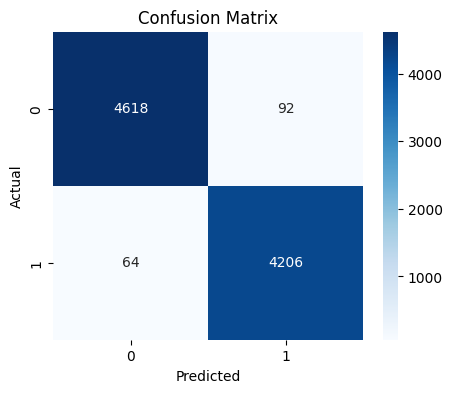

# 📊 Research & Modeling Notebooks

This directory encapsulates the research, exploratory data analysis (EDA), text pre-processing pipelines, and baseline classifier experiments for the Neurolingual Authenticity Platform.

## 📖 Contents

1. **`fake_news.ipynb`**: The primary Jupyter Notebook for this repository. It provides an interactive cell-by-cell walkthrough of everything that `train_models.py` automates.
   - **Data Visualization**: Evaluates token density and semantic correlations.
   - **Baseline Comparisons**: Benchmarks `LogisticRegression` strictly against `MultinomialNB`.
   - **Insights**: Details exactly why Logistic Regression handles sparse `TF-IDF` word vectors from headlines remarkably well.

## 📈 Evaluation & Diagnostics

Evaluating ML text classifiers requires deep precision beyond standard accuracy. The notebook evaluates True Positives and False Positives via a Confusion Matrix explicitly. 



*(Note: The above diagram is a reference matrix visualization. While exact numbers scale based on dataset permutation, it underscores the remarkably low False Positive rate typically achieved on the ISOT linguistic dataset).*

## ⚙️ How to use
You do not need to run this notebook to launch the web app. It is provided strictly for educational insight into NLP. If you choose to execute it, make sure you have `jupyter` installed:
```bash
pip install jupyter
jupyter notebook
```
