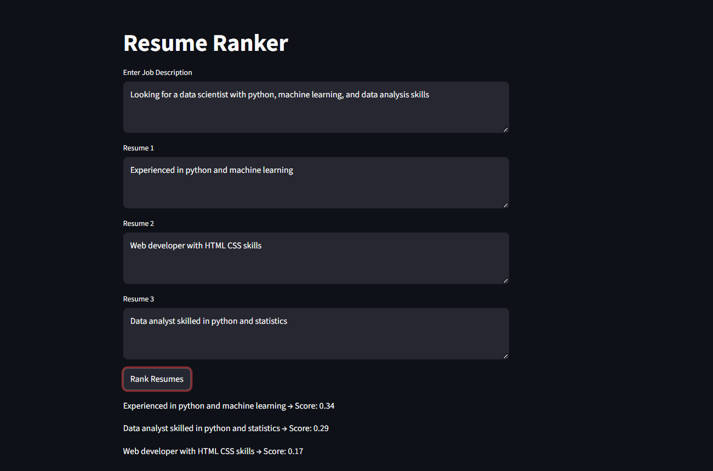

# Resume Ranker 📄

## 📌 Overview
This project implements an AI-based Resume Ranking System that evaluates and ranks resumes based on their relevance to a given job description. It uses Natural Language Processing (NLP) techniques to compute similarity scores and assist in automated candidate screening.

---

## 🎯 Objective
To automate the resume shortlisting process by comparing candidate resumes with job requirements and ranking them based on relevance.

---

## 🛠️ Tools & Technologies
- Python  
- Pandas  
- Scikit-learn  
- TF-IDF Vectorization  
- Cosine Similarity  
- Streamlit  

---

## ⚙️ Methodology

### 1. Text Preprocessing
- Input job description and resumes  
- Convert text data into numerical format  

### 2. Feature Extraction
- Applied **TF-IDF Vectorization** to extract meaningful features from text  

### 3. Similarity Calculation
- Used **Cosine Similarity** to measure the relevance between job description and resumes  

### 4. Ranking System
- Computed similarity scores  
- Sorted resumes based on highest relevance  

### 5. Deployment
- Developed a simple **Streamlit UI** for user interaction  

---

## 📈 Results

The system successfully ranks resumes based on their similarity to the job description.

### 🔹 Output

---

## 🧪 How to Run

- Clone Repository: git clone https://github.com/rohanronniie/Applied-AI-ML-Portfolio.git
- Navigate to Folder: cd Resume-Ranker
- Install Requirements: pip install pandas scikit-learn streamlit
- Run Notebook: jupyter notebook resume_ranker.ipynb
- Run Application: python -m streamlit run app.py

---

## 📁 Project Structure

- resume_ranker.ipynb  
- app.py  
- ui_output.png  
- README.md  

---

## 🚀 Conclusion
This project demonstrates how NLP techniques can be effectively used to automate resume screening and improve recruitment efficiency. It reduces manual effort and helps in identifying the most relevant candidates quickly.

---

## ⚠️ Limitations
- Works on textual similarity only  
- Does not consider experience depth or context  
- Sensitive to input wording  

---

## 🔮 Future Improvements
- Use advanced NLP models like BERT  
- Add PDF resume parsing  
- Integrate real-world job datasets  
- Build full HR dashboard system  
